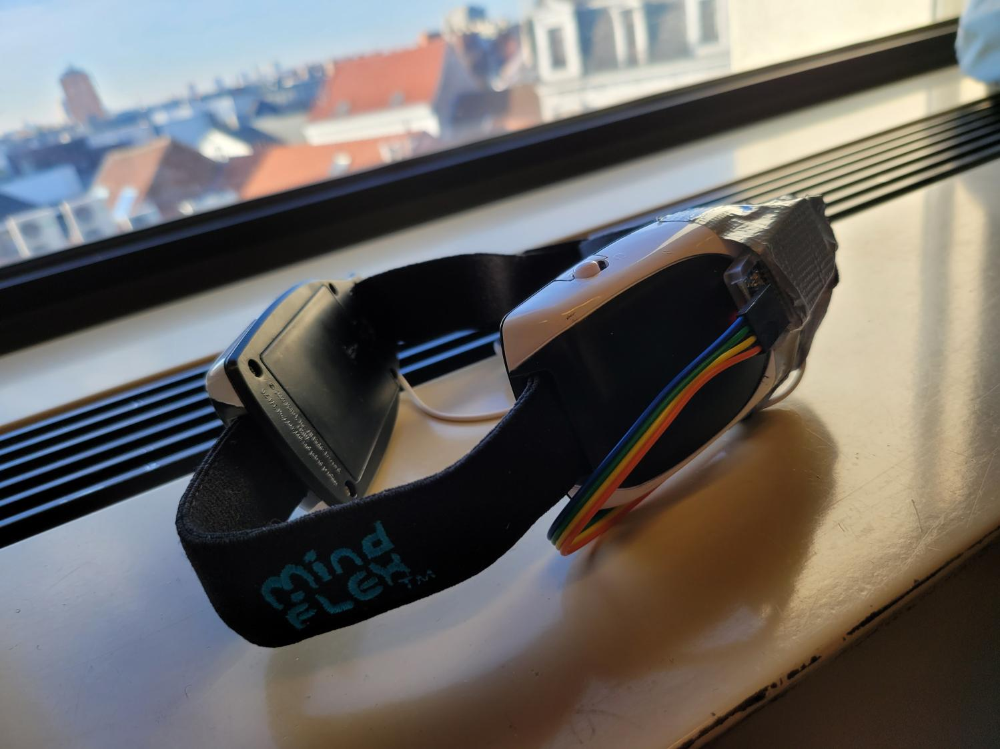

<!-- Improved compatibility of back to top link: See: https://github.com/othneildrew/Best-README-Template/pull/73 -->
<a name="readme-top"></a>
<!-- PROJECT LOGO -->
<br />
<div align="center">
  <a href="https://github.com/othneildrew/Best-README-Template" name="readme-top">
    
  </a>

<h3 align="center">Project Eirene</h3>

  <p align="center">
    Peace of Mind
    <br />
    <a href="https://gitlab.com/kdg-ti/integration-2.1/22-23/team-3/project-planning/-/wikis/Wiki"><strong>Explore the docs »</strong></a>
    <br />
    <br />
    <a href="https://gitlab.com/kdg-ti/integration-2.1/22-23/team-3/project-planning/-/tree/main">View Demo</a>
  </p>
</div>


<!-- TABLE OF CONTENTS -->
<details>
  <summary>Table of Contents</summary>
  <ol>
    <li>
      <a href="#about-the-project">About The Project</a>
      <ul>
        <li><a href="#built-with">Built With</a></li>
      </ul>
    </li>
    <li>
      <a href="#getting-started">Getting Started</a>
    </li>
    <li><a href="#usage">Usage</a></li>
    <li><a href="#roadmap">Roadmap</a></li>
    <li><a href="#contact">Contact</a></li>
    <li><a href="#acknowledgments">Acknowledgments</a></li>
  </ol>
</details>


<!-- ABOUT THE PROJECT -->

## About The Project



Project Eirene is a student project for the Karel de Grote Hogeschool. The goal of this project is to create a device
that can measure the stress levels of a person and provide feedback to the user. This feedback can be used to help the
user relax and reduce stress levels. The device will be able to measure the focus/meditation levels of the user by using
a
Mindflex EEG headset. The headset will be connected to an Arduino which will send the data to a Java application. The
Java application will then process the data and provide feedback to the user.

Here's why:

* The goal of this project is to create a device that can measure the focus/meditation levels of a person and provide
  feedback to the user.
* This will enable the user to be more mindful about their emotions and how the environment affects them.
* It's cool to look at your brainwaves on a screen.

<p align="right">(<a href="#readme-top">back to top</a>)</p>

### Built With

* [![Java][Java]][Java-url]
* [![Spring][spring.io]][Spring-url]
* [![TS][TS]][TS-url]
* [![Hibernate][hibernate]][hibernate-url]
* [![C++][C++]][C++-url]
* [![Arduino][Arduino]][Arduino-url]
* [![PostgreSQL][PostgreSQL]][PostgreSQL-url]

<p align="right">(<a href="#readme-top">back to top</a>)</p>

<!-- GETTING STARTED -->

## Getting Started

### Prerequisites

To run this project you need to have the following hardware:

* Arduino Uno / Genuino 101
* A modified Mindflex EEG headset
* A computer with a bluetooth adapter
* A computer with a USB port

Arduino Sensors:

* Heart Rate Sensor
* Temperature/Humidity Sensor
* Light Sensor
* Sound Sensor
* Accelerometer

[//]: # (### Installation)

[//]: # ()

[//]: # (_Below is an example of how you can instruct your audience on installing and setting up your app. This template doesn't)

[//]: # (rely on any external dependencies or services._)

[//]: # ()

[//]: # (1. Get a free API Key at [https://example.com]&#40;https://example.com&#41;)

[//]: # (2. Clone the repo)

[//]: # (   ```sh)

[//]: # (   git clone https://github.com/your_username_/Project-Name.git)

[//]: # (   ```)

[//]: # (3. Install NPM packages)

[//]: # (   ```sh)

[//]: # (   npm install)

[//]: # (   ```)

[//]: # (4. Enter your API in `config.js`)

[//]: # (   ```js)

[//]: # (   const API_KEY = 'ENTER YOUR API';)

[//]: # (   ```)

[//]: # ()

[//]: # (<p align="right">&#40;<a href="#readme-top">back to top</a>&#41;</p>)


<!-- USAGE EXAMPLES -->

## Usage

This project can be used to help people relax and reduce stress levels while improving productivity. The device will be
able to measure the focus/meditation. Based on the arduino sensors, it will collect the data and give the user advice on
improving their work focus

_For more examples, please refer to
the [Documentation](https://gitlab.com/kdg-ti/integration-2.1/22-23/team-3/project-planning/-/wikis/Wiki)_

<p align="right">(<a href="#readme-top">back to top</a>)</p>


<!-- ROADMAP -->

## Roadmap

- [x] Add Readme
- [x] Add Wiki
- [ ] Make the product work

See the [open issues](https://gitlab.com/kdg-ti/integration-2.1/22-23/team-3/project-planning/-/boards) for a full list
of features we're working on

<p align="right">(<a href="#readme-top">back to top</a>)</p>

<!-- LICENSE -->

## License

Distributed under the MIT License.

<p align="right">(<a href="#readme-top">back to top</a>)</p>


<!-- CONTACT -->

## Contact

Elina Van der Taelen - elina.vandertaelen@student.kdg.be

Filip Nowak - filip.nowak@student.kdg.be

Peter Buschenreiter - peter.buschenreiter@student.kdg.be

Seifeldin Sabry - seifeldin.sabry@student.kdg.be

Project
Link: [https://gitlab.com/kdg-ti/integration-2.1/22-23/team-3/project-planning](https://gitlab.com/kdg-ti/integration-2.1/22-23/team-3/project-planning)

<p align="right">(<a href="#readme-top">back to top</a>)</p>


<!-- ACKNOWLEDGMENTS -->

## Acknowledgments

* [Img Shields](https://shields.io)
* [Font Awesome](https://fontawesome.com)
* [ReadMe Template](https://github.com/othneildrew/Best-README-Template)

<p align="right">(<a href="#readme-top">back to top</a>)</p>


<!-- MARKDOWN LINKS & IMAGES -->
<!-- https://www.markdownguide.org/basic-syntax/#reference-style-links -->

[contributors-shield]: https://img.shields.io/github/contributors/othneildrew/Best-README-Template.svg?style=for-the-badge

[contributors-url]: https://github.com/othneildrew/Best-README-Template/graphs/contributors

[forks-shield]: https://img.shields.io/github/forks/othneildrew/Best-README-Template.svg?style=for-the-badge

[forks-url]: https://github.com/othneildrew/Best-README-Template/network/members

[stars-shield]: https://img.shields.io/github/stars/othneildrew/Best-README-Template.svg?style=for-the-badge

[stars-url]: https://github.com/othneildrew/Best-README-Template/stargazers

[issues-shield]: https://img.shields.io/github/issues/othneildrew/Best-README-Template.svg?style=for-the-badge

[issues-url]: https://github.com/othneildrew/Best-README-Template/issues

[license-shield]: https://img.shields.io/github/license/othneildrew/Best-README-Template.svg?style=for-the-badge

[license-url]: https://github.com/othneildrew/Best-README-Template/blob/master/LICENSE.txt

[linkedin-shield]: https://img.shields.io/badge/-LinkedIn-black.svg?style=for-the-badge&logo=linkedin&colorB=555

[linkedin-url]: https://linkedin.com/in/othneildrew

[product-screenshot]: images/screenshot.png

[Next.js]: https://img.shields.io/badge/next.js-000000?style=for-the-badge&logo=nextdotjs&logoColor=white

[Next-url]: https://nextjs.org/

[React.js]: https://img.shields.io/badge/React-20232A?style=for-the-badge&logo=react&logoColor=61DAFB

[React-url]: https://reactjs.org/

[Vue.js]: https://img.shields.io/badge/Vue.js-35495E?style=for-the-badge&logo=vuedotjs&logoColor=4FC08D

[Vue-url]: https://vuejs.org/

[Angular.io]: https://img.shields.io/badge/Angular-DD0031?style=for-the-badge&logo=angular&logoColor=white

[Angular-url]: https://angular.io/

[Svelte.dev]: https://img.shields.io/badge/Svelte-4A4A55?style=for-the-badge&logo=svelte&logoColor=FF3E00

[Svelte-url]: https://svelte.dev/

[Laravel.com]: https://img.shields.io/badge/Laravel-FF2D20?style=for-the-badge&logo=laravel&logoColor=white

[Laravel-url]: https://laravel.com

[Bootstrap.com]: https://img.shields.io/badge/Bootstrap-563D7C?style=for-the-badge&logo=bootstrap&logoColor=white

[Bootstrap-url]: https://getbootstrap.com

[JQuery.com]: https://img.shields.io/badge/jQuery-0769AD?style=for-the-badge&logo=jquery&logoColor=white

[JQuery-url]: https://jquery.com

[Spring.io]: https://img.shields.io/badge/Spring-6DB33F?style=for-the-badge&logo=spring&logoColor=white

[spring-url]: https://spring.io/

[TS]: https://img.shields.io/badge/TypeScript-007ACC?style=for-the-badge&logo=typescript&logoColor=white

[TS-url]: https://www.typescriptlang.org/

[Hibernate]: https://img.shields.io/badge/Hibernate-59666C?style=for-the-badge&logo=hibernate&logoColor=white

[Hibernate-url]: https://hibernate.org/

[C++]: https://img.shields.io/badge/C++-00599C?style=for-the-badge&logo=c%2B%2B&logoColor=white

[C++-url]: https://www.cplusplus.com/

[Arduino]: https://img.shields.io/badge/Arduino-00979D?style=for-the-badge&logo=arduino&logoColor=white

[Arduino-url]: https://www.arduino.cc/

[Java]: https://img.shields.io/badge/Java-ED8B00?style=for-the-badge&logo=java&logoColor=white

[Java-url]: https://www.java.com/

[PostgreSQL]: https://img.shields.io/badge/PostgreSQL-316192?style=for-the-badge&logo=postgresql&logoColor=white

[PostgreSQL-url]: https://www.postgresql.org/
