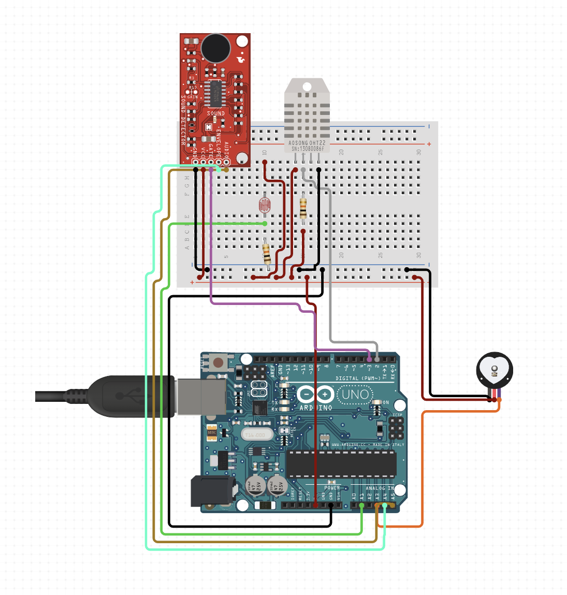

## Spike: Syncing sensor data

### 1) What problem are we trying to solve?

Trying to connect the sensors to the arduino and sync the data

### 2) Possible solution:

Bread board >> Arduino connection

### 2.1) Is this solution feasible?

Yes, although setting up the breadboard is a bit of a hassle, need to find a more permanent solution (e.g. a 3D-printed box to fit the arduino & sensors)

### 2.2) How much effort does this solution need?

- _Give a time estimation of the solution_: 1 week
- _Is there enough knowledge in the team?_: Yes, we have people experienced with working with a breadboard

### 2.3) Complete documentation of this solution

